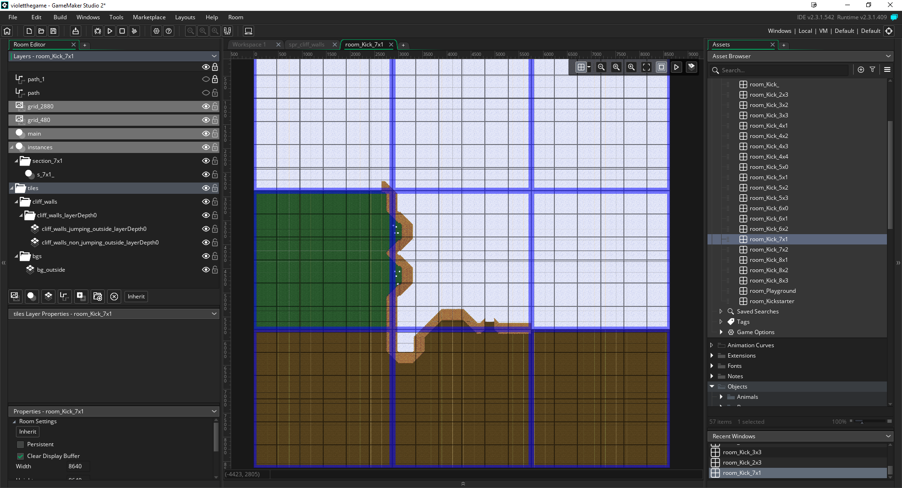
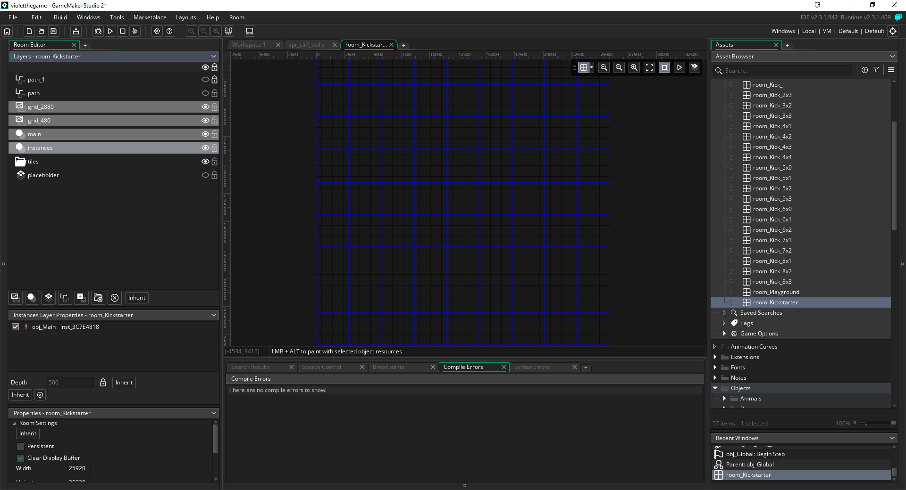

# GMS Tasks - Build

The purpose of the `build` command is to take instances in several rooms and copy / paste them into the "main" room.

Let's say we are building an open world game in Game Maker Studio 2.  We've found that after a while, using the room editor with thousands of instances makes the room editor slow and unusable.  The solution was to create "copies" of each room, in their full size, and only work on a section for each room.  Then, when it comes time to "test" the game in the "main" room, we can run `npm run build` to merge these instances into the one room.

## Installation

In the config file `gms-tasks-config.json`, we have these values that we can configure:

```
"build-clean-snap": {
    "roomDir": "./rooms/",
    "exportRoom": "room_Kickstarter",
    "copyRoomPattern": "room_Kick_",
    "instanceCreationOrderId_InsertAt": 7,
    "layerToInsertName": "instances"
},
"build": {
    "ignoreRoomsBuild": [
      "room_Kick_",
      "room_Kick_Temp"
    ]
},
```

* `build-clean-snap` - these change the config values for the `build`, `clean` and `snap` commands
* `roomDir` - the default room directory.  Shouldn't need to change
* `exportRoom` - the name of the room you want all your instances to be merged to
* `copyRoomPattern` - the name of the rooms you want to copy from.  Everything after the last character of this string becomes a wildcard character.  For example, room_Kick_Hello would be copied
* `instanceCreationOrderId_InsertAt` - since initially all the original rooms are copies of each other, we have a few instances that are "global" that we shouldn't copy over in the instance creation tree.  For example, the player instance, a global instance, camera instance and a few others are present in every room.  A better way to think about this is the count of the instances that are present in each copy of the room.
* `layerToInsertName` - the name of the root layer where all instances are put
* `build` - these change the config values for the `build` command only
* `ignoreRoomsBuild` - an array of rooms to be excluded from the merge

## Setup in Game Maker Studio 2

We currently have a base room called `room_Parent` which children rooms inherit several "global" instances.  These include the main character, the camera instance, and a few others.  The instances can be excluded from copying using the `instanceCreationOrderId_InsertAt` config var.  From there, we have a base room called `room_Kick_` that's simply inherits the parent, but is empty.  When we want to create new "sections", we'll copy and paste this room and add instances to that section.

We name each room according to the section number.  So `room_Kick_2x3` represents the 3rd row, 4th column section of the open world room.  We can name these rooms to whatever though, as long as the `copyRoomPattern` base renames the same for all of these rooms.

Now, we can add instances to each section of the room, keeping each section a unique room, and keeping our room editor usuable again.  *Note*, only instances are copied over.  Keep our main room empty (besides our global instances), and simply update tiles, backgrounds, etc. as needed in the main room.  We can copy those over into our sectional rooms if we need to for creating our "section" better.

*Note* - we copy sub layer's of instances, as well as instances.  We need to be sure layer names are unique in our section rooms because the task currently doesn't account for that.  We've been simply been naming our layers `s_2x3_what_the_layer_is` which ensures uniqueness across section rooms.

## Running

Run `npm run build` to copy all instances to you main room.  *Note* - we don't ever commit the main room to version control.  To revert the room back to it's clean state, simply run `npm run clean`.  *Note* - running `build` runs a `clean` first.

## Examples





## Contributing

Thank you for considering contributing to GMS Tasks! To encourage active collaboration, we encourage pull requests, not just issues.

If you file an issue, the issue should contain a title and a clear description of the issue. You should also include as much relevant information as possible and a code sample that demonstrates the issue. The goal of a issue is to make it easy for yourself - and others - to replicate the bug and develop a fix.

## License

GMS Tasks is open-sourced software licensed under the [MIT license](http://opensource.org/licenses/MIT).
